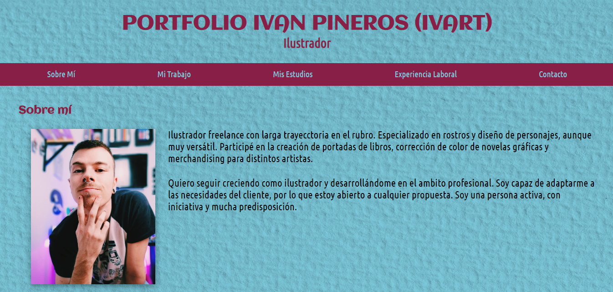
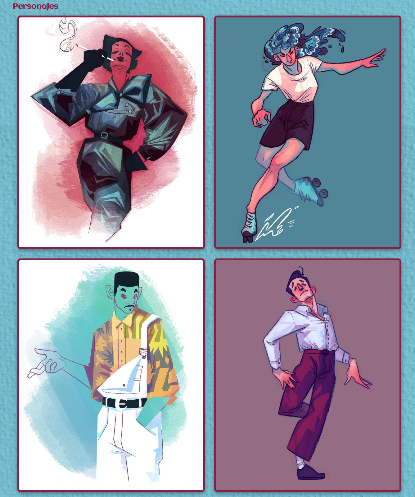
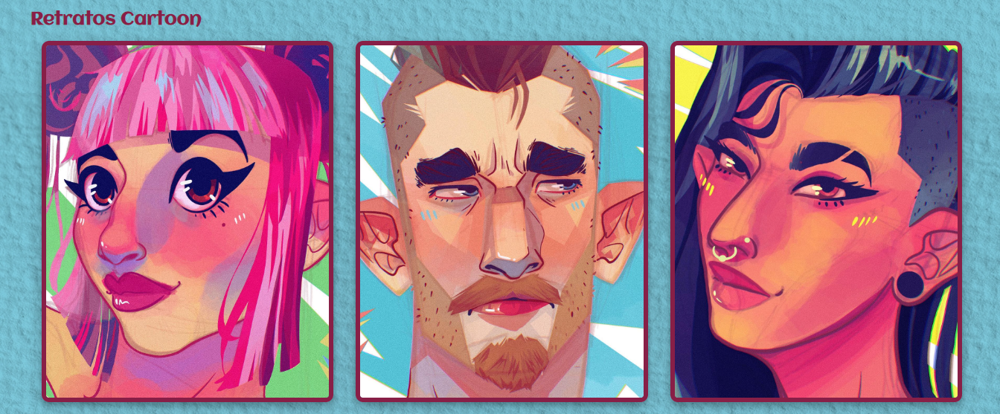
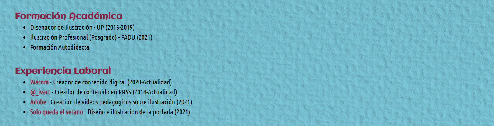
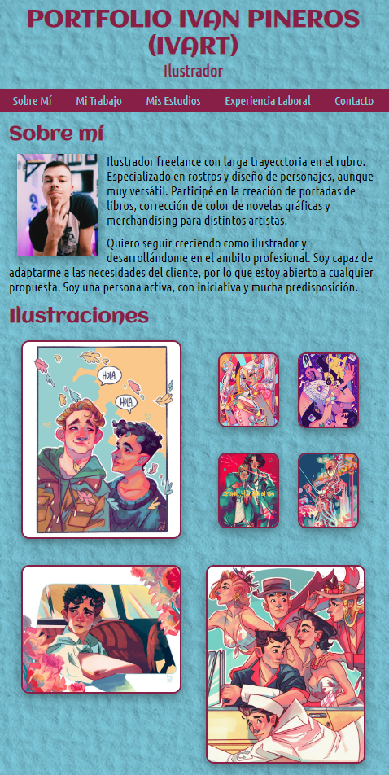

# Portfolio Ivan Pineros
## Diseño de web visual

## Introducción

A lo largo de este documento haremos un análisis de las decisiones visuales tomadas para el diseño de un Portfolio del ilustrador Ivan Pineros, a modo de ejemplo (no es su portfolio real).

## Página principal
En el header tenemos una barra de navegación con la propiedad Sticky para que el usuario pueda navegar fácilmente a través de las ilustraciones del artista. Veremos una presentación de él, sus trabajos distribuidos y categorizados para que sea más dinámica la navegación y, por úlitmo, sus estudios, experiencia y contacto.
##### Presentación

##### Ilustraciones

##### Personajes

##### Retratos

##### Experiencia y estudios

##### Footer con contacto

## Diseño responsive

Para permitir la visualización en distintos dispositivos, desarrollé un diseño responsive en el portfolio web.

## Decisiones visuales

Elegí esa paleta de colores ya que son tonos muy utilizados por el artista. Un fondo con textura de papel ya que es ilustrador y una tipografía que sea fácil de leer pero con movimiento, al igual que las ilustraciones del artista.

## Conclusión

Gracias a esto logramos que el usuario pueda ver de forma rápida, fácil y clara los trabajos del artista, y de igual forma ponerse en contacto con él. Tenemos información extra en caso de que desee verla. Creamos toda una experiencia agradable y armoniosa, generando una sensación de integridad entre los trabajos del artista y la web creada.